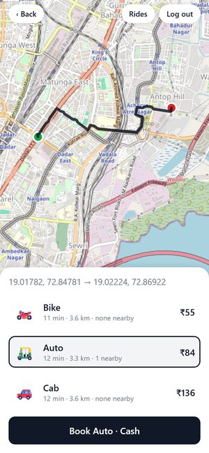
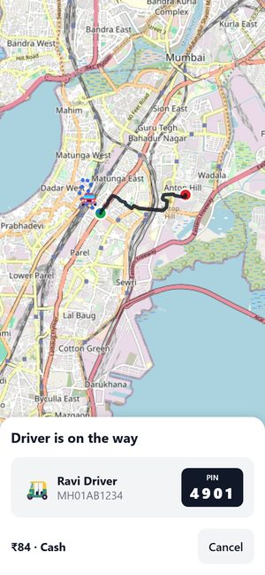
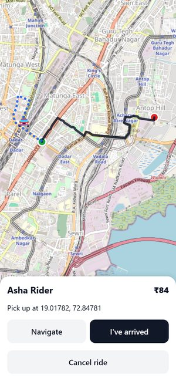
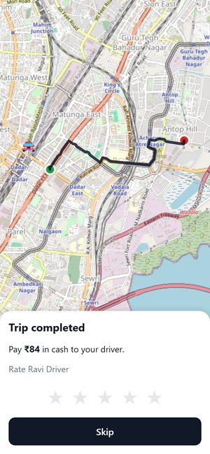

# UberClone: open-source ride-hailing for Indian cities

A complete ride-hailing app (rider app, driver app, backend), with **its own routing and matching engines** running on real **Mumbai** roads from OpenStreetMap. Built in the open for anyone to learn from and contribute to.

| | | | |
|:-:|:-:|:-:|:-:|
|  |  |  |  |
| Bike / auto / cab fares along the road route | Driver on the way, with the ride PIN | Driver app: dotted path to the pickup | Trip done: pay cash, rate |

## What it does

- **Rider app:** set pickup and drop on the map, compare **bike, auto and cab** fares, book, watch the driver arrive live, share a 4-digit PIN, pay cash, rate, see ride history.
- **Driver app:** register a vehicle, go online, get ride requests with a 20-second countdown, accept, navigate, start with the PIN, complete, see earnings.
- **Matching:** each request goes to up to 3 nearby drivers of the right vehicle; the nearest one who accepts gets the ride.
- **Routing built for India:**
  - real roads, with main roads preferred over side streets;
  - legal speed limits per vehicle;
  - private roads, tolls and military zones;
  - left-hand-traffic turns, waits at signals and toll booths, speed breakers.
- **Tests you can see:** one command runs every test, including a browser robot that plays a full ride in both apps and saves screenshots of every step.

New here? Read the **[application overview](docs/OVERVIEW.md)** first.

## Quick start

On Windows PowerShell, with Python 3.11+ and Node 20+ installed (full details for every situation in **[RUNNING.md](RUNNING.md)**):

```powershell
python -m pip install -r requirements-dev.txt     # backend, routing, tests
cd mobile; npm install; cd ..                      # apps
```

Then build the Mumbai road data once (about 5 minutes; [RUNNING.md § A4](RUNNING.md#a-first-time-setup)), and:

```powershell
python demo.py                          # window 1: backend + automatic cab, auto and bike drivers near Dadar
cd mobile; npm run start:rider          # window 2: scan the QR code with Expo Go, book a ride, watch it happen
python test_all.py                      # run every test; opens a report with screenshots
```

## Find your way around

| I want to… | Read |
|---|---|
| Understand how the app works | [docs/OVERVIEW.md](docs/OVERVIEW.md) |
| Run it (phone, two phones, browser, tests, another city) | [RUNNING.md](RUNNING.md) |
| Contribute | [CONTRIBUTING.md](CONTRIBUTING.md) and the [open issues](#open-issues) below |
| See every document | [docs/README.md](docs/README.md) |

```
UberClone/
├── mobile/          Rider and driver apps (Expo / React Native, TypeScript)
├── backend/         API, live events, dispatch loop, simulator (Python, FastAPI)
├── matching/        Matching engine: which drivers get pinged, who wins
├── routing/         Routing engine: road graph, costs, vehicles, turns, restrictions, learning, OSM import
├── tests/           Tests for routing and matching
├── e2e/             Browser robot that plays a full ride in both apps
├── deploy/          GraphHopper configuration (production routing engine)
├── docs/            Design docs, overview, issues
├── demo.py          Phone demo: backend + automatic drivers
├── test_all.py      Run every check
└── RUNNING.md       How to run in every situation
```

## Open issues

Pick one and contribute. Each issue explains why it matters, what to do, which files to look at, and how to know you're done. The workflow is in [CONTRIBUTING.md](CONTRIBUTING.md).

### 🟢 Good first issues (a few hours)

| # | Issue | Area | Skills |
|---|---|---|---|
| 003 | [Rate-limit OTP requests](docs/issues/003-rate-limit-otp-requests.md) | backend, security | Python |
| 004 | [Show how far the pickup is on the driver's ride request](docs/issues/004-pickup-distance-on-ping-card.md) | backend + driver app | Python, TypeScript |
| 005 | [Pickup note for the driver ("Gate 2, near the ATM")](docs/issues/005-pickup-note-for-driver.md) | backend + both apps | Python, TypeScript |
| 006 | [Show how the fare is calculated](docs/issues/006-fare-breakdown.md) | backend + rider app | Python, TypeScript |
| 007 | [Dark mode](docs/issues/007-dark-mode.md) | apps | React Native, design |
| 008 | [Accessibility: screen-reader labels, touch targets](docs/issues/008-accessibility-pass.md) | apps | React Native |
| 009 | [Weekly earnings for drivers](docs/issues/009-driver-weekly-earnings.md) | backend + driver app | Python, TypeScript |
| 010 | [Run tests on every pull request (GitHub Actions)](docs/issues/010-github-actions-ci.md) | DevOps | YAML |
| 011 | [More end-to-end scenarios: cancellations, no drivers](docs/issues/011-more-e2e-scenarios.md) | testing | Python, Playwright |

### 🟡 Medium (a day or two)

| # | Issue | Area | Skills |
|---|---|---|---|
| 012 | [**Search for pickup and drop places**](docs/issues/012-place-search.md) (today you can only drag a pin) | backend + rider app | Python, TypeScript, APIs |
| 013 | [Street addresses instead of coordinates](docs/issues/013-street-addresses-everywhere.md) | backend + apps | Python, TypeScript |
| 014 | [Saved places (Home, Work)](docs/issues/014-saved-places.md) | backend + rider app | Python, TypeScript |
| 015 | ["Arriving in 4 min" for the rider](docs/issues/015-live-driver-eta-for-rider.md) | backend + rider app | Python, TypeScript |
| 016 | [Final fare from the actual trip (distance + waiting)](docs/issues/016-metered-final-fare.md) | backend | Python, geometry |
| 017 | [Cancellation fee rules](docs/issues/017-cancellation-fee.md) | backend + apps | Python |
| 018 | [Hindi and Marathi translations](docs/issues/018-hindi-marathi-translations.md) | apps | React Native, Hindi / Marathi |
| 019 | [Share my trip, and an SOS button](docs/issues/019-share-trip-and-sos.md) | backend + rider app | Python, TypeScript |
| 020 | [Database migrations (Alembic) and PostgreSQL](docs/issues/020-database-migrations-postgres.md) | backend | SQLAlchemy, SQL |
| 021 | [One-command setup with Docker Compose](docs/issues/021-docker-compose.md) | DevOps | Docker |
| 022 | [Admin web dashboard](docs/issues/022-admin-web-dashboard.md) | new web app | React, maps |
| 001 | [ETA before we have our own data](docs/issues/001-eta-approximation.md) | routing | Python |

### 🔴 Hard (for experienced contributors or teams)

| # | Issue | Area | Skills |
|---|---|---|---|
| 023 | [**Feed real driver GPS into road learning**](docs/issues/023-feed-driver-gps-into-road-learning.md) (high impact) | backend + routing | map matching, Python |
| 024 | [Road-based pickup times in matching, fast](docs/issues/024-road-pickup-eta-in-matching.md) | routing + matching | algorithms |
| 025 | [Push notifications and background GPS for drivers](docs/issues/025-push-notifications-background-gps.md) | apps + backend | Expo dev builds |
| 026 | [Surge pricing](docs/issues/026-surge-pricing.md) | backend + rider app | Python, data |
| 027 | [Run several backend instances (Redis)](docs/issues/027-multi-instance-backend-redis.md) | backend | asyncio, Redis |
| 028 | [Learn signal waits and turn costs from real trips](docs/issues/028-learn-signal-waits-and-turn-costs.md) | routing | statistics |
| 002 | [GraphHopper plugin for vehicles, delays, speed breakers](docs/issues/002-graphhopper-extensions.md) | routing | Java, GraphHopper |

**Issues that build on each other:**
- **013** reuses the place-lookup provider from **012**, and **014** can share its "recent places" list with **012**.
- **016**, **023** and **028** use driver GPS breadcrumbs; **028** needs **023**.
- **005**, **016** and **017** add database columns, which will need migrations once **020** lands.
- **027** works best after **020**.

**Ideas without an issue yet:** in-app chat or masked calling, scheduled rides, promo codes, driver document verification, more than one city, ride receipts, online payments (UPI / cards in test mode). Open a discussion first.

## Status and limits

This is a working development version, not a production service:
- **Login and payment:** the login code is always `123456` (no SMS), and payment is cash only.
- **One city:** only Mumbai's roads are loaded.
- **Driver GPS:** works only while the driver app is open.

[docs/OVERVIEW.md](docs/OVERVIEW.md#whats-real-and-whats-simplified-for-now) lists what's real and what's simplified.

## License

[MIT](LICENSE): you can use, change and share this code freely, as long as the copyright notice stays. By contributing, you agree your changes are released under the same license.
