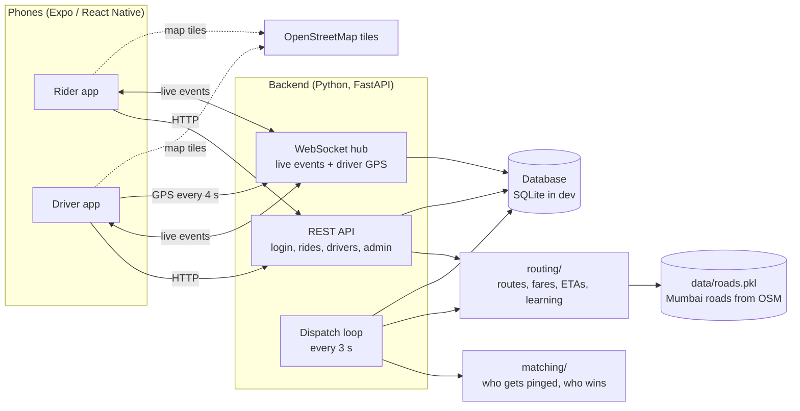
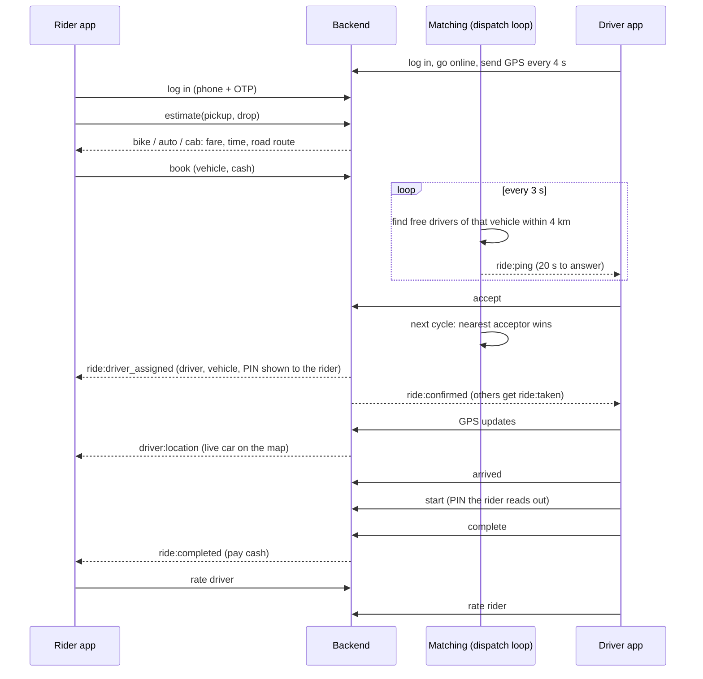

# Application overview

This page explains **what the application is, how its parts fit together, and what happens during a ride**. Read it before diving into the code. For how to run it, see [RUNNING.md](../RUNNING.md).

## What it is

An open-source ride-hailing app (like Uber or Ola) built for Indian cities, with real road data for **Mumbai**:

- **Rider app:** choose pickup and drop on a map, compare **bike / auto / cab** fares, book, watch the driver arrive, share a PIN, pay cash, rate.
- **Driver app:** register a vehicle, go online, receive ride requests, accept, navigate, start the trip with the rider's PIN, complete, see earnings.
- **Backend:** accounts, rides, fares, live updates, and a **matching engine** that decides which drivers get each request.
- **Routing engine (written from scratch):** finds routes on real OpenStreetMap roads. It knows Indian speed limits, private roads, tolls, turn rules for left-hand traffic, and delays at signals. It's designed to learn slow and avoided roads from driver GPS.

| | |
|:-:|:-:|
|  |  |
| Rider: fares and the road route | Rider: driver on the way, with the PIN |

## The pieces



| Piece | Folder | What it does |
|---|---|---|
| Rider and driver apps | `mobile/` | One Expo codebase that builds two apps (`EXPO_PUBLIC_APP_VARIANT=rider` or `driver`). The maps are Leaflet with OpenStreetMap tiles. They also run in a browser, which the automated tests use |
| Backend | `backend/` | FastAPI app: phone OTP login, ride lifecycle, fares, WebSocket events, the dispatch loop, admin endpoints |
| Matching engine | `matching/` | Each cycle: ping up to 3 nearby free drivers per waiting rider, choose the nearest driver who accepted, handle timeouts and cancellations |
| Routing engine | `routing/` | Road graph and route search, the cost model, vehicle rules, restrictions, the OSM importer, and telemetry learning |
| Road data | `data/` (not in git) | Mumbai's road network built from OpenStreetMap (`python -m routing.osm_import`) |
| Tests and tools | `tests/`, `backend/tests/`, `mobile/src/**/__tests__/`, `e2e/`, `test_all.py`, `demo.py` | Unit tests, a browser robot that plays a full ride, and a phone demo with automatic drivers |
| GraphHopper setup | `deploy/graphhopper/` | Configuration for running the same model on GraphHopper, a fast Java routing engine, at production scale |

## A ride, step by step



**Ride states:**

```
searching ──► driver_assigned ──► driver_arrived ──► in_progress ──► completed
   │                │                    │
   ├─► no_drivers   └──── cancelled ─────┘     (if the driver cancels, the ride goes back to searching)
```

## Key ideas, in plain words

### How a route is chosen
Every road segment gets a cost: **distance ÷ (speed × priority)**.
- **Priority** expresses preference. Main roads are 1.0, residential streets 0.5, so they cost twice as much per km. Private roads, no-entry roads and military areas are blocked.
- **Speed** starts uniform (30 km/h), is capped by the **legal speed limit** for that vehicle, and is slightly lower where there are **speed breakers**.
- On top of the road cost come **fixed waits** at traffic signals (about 30 s), toll booths and railway crossings, and **turn costs**. India drives on the left, so right turns, which cross traffic, cost more than left turns. Banned turns from the map are never taken.
- **Each vehicle has its own rules.** Autos can't use expressways and are limited to 50 km/h. Bikes don't pay tolls at national-highway plazas. Bikes and autos mind small lanes less than cabs do.

Details: [ROUTING.md](ROUTING.md), [VEHICLES_AND_TURNS.md](VEHICLES_AND_TURNS.md), [MAP_DATA.md](MAP_DATA.md).

### Where the road data comes from
OpenStreetMap's western-India extract, clipped to Mumbai: about 285,000 road segments per vehicle type, with 2,100 traffic signals, toll booths, speed breakers, turn restrictions and restricted zones. When you tap the map, the point is attached to the nearest **usable** road in the main connected network. It never lands on an expressway, a private lane, or a cut-off fragment of road. Details: [MAP_DATA.md](MAP_DATA.md), [BACKEND.md](BACKEND.md#road-data-routes-that-follow-the-roads).

### How drivers are matched
Every 3 seconds the backend asks the matching engine:
- **Who gets pinged:** for each waiting rider, ping up to 3 free drivers of the right vehicle within 4 km. 20% of free drivers are held back for the next cycle.
- **Who wins:** when several drivers accept, the nearest one gets the ride.
- **Timeouts:** an unanswered ping expires after 20 s, and that driver isn't asked again for that ride. A ride nobody takes within 3 minutes ends as "no drivers".

Details: [MATCHING.md](MATCHING.md).

### Learning from drivers (designed, not yet fed with real data)
The routing engine can learn from driver GPS:
- **Which roads are slower than expected**, telling time-of-day **traffic** apart from permanent **road condition** such as potholes.
- **Which roads drivers avoid.**

It does this cautiously, so one odd trip can't reshape the network. The backend already stores every GPS point. Connecting the two (map matching) is [issue 023](issues/023-feed-driver-gps-into-road-learning.md). Details: [ROAD_LEARNING.md](ROAD_LEARNING.md).

## Technology

| Layer | Technology |
|---|---|
| Apps | Expo SDK 57, React Native, TypeScript, Expo Router, Leaflet in a WebView / iframe, OpenStreetMap tiles |
| Backend | Python 3.11+, FastAPI, SQLAlchemy (async), SQLite in development (PostgreSQL: [issue 020](issues/020-database-migrations-postgres.md)), JWT, WebSockets |
| Routing and matching | Pure Python: an edge-based A* search, pyosmium for OpenStreetMap import, optional GraphHopper for production |
| Tests | pytest, Jest, Playwright (a browser robot playing a full ride) |

## What's real and what's simplified (for now)

| Real | Simplified in this version |
|---|---|
| Road routing on real Mumbai roads, legal speed limits, turn and access rules | Expected speed is uniform (30 km/h) until learning is connected ([issue 001](issues/001-eta-approximation.md), [issue 023](issues/023-feed-driver-gps-into-road-learning.md)) |
| Full ride lifecycle, matching, live updates, ratings | Login code is always `123456` (no SMS); cash only |
| Rider and driver apps on phones (Expo Go) | Pickup and drop by dragging a pin, no search yet ([issue 012](issues/012-place-search.md)); driver GPS only while the app is open ([issue 025](issues/025-push-notifications-background-gps.md)) |
| Automated tests including a full UI ride | One city (Mumbai) and one backend process ([issue 027](issues/027-multi-instance-backend-redis.md)) |

## Where to go next

- **Run it:** [RUNNING.md](../RUNNING.md)
- **Contribute:** [CONTRIBUTING.md](../CONTRIBUTING.md), and the issue list in the [README](../README.md#open-issues)
- **All documents:** [docs/README.md](README.md)
