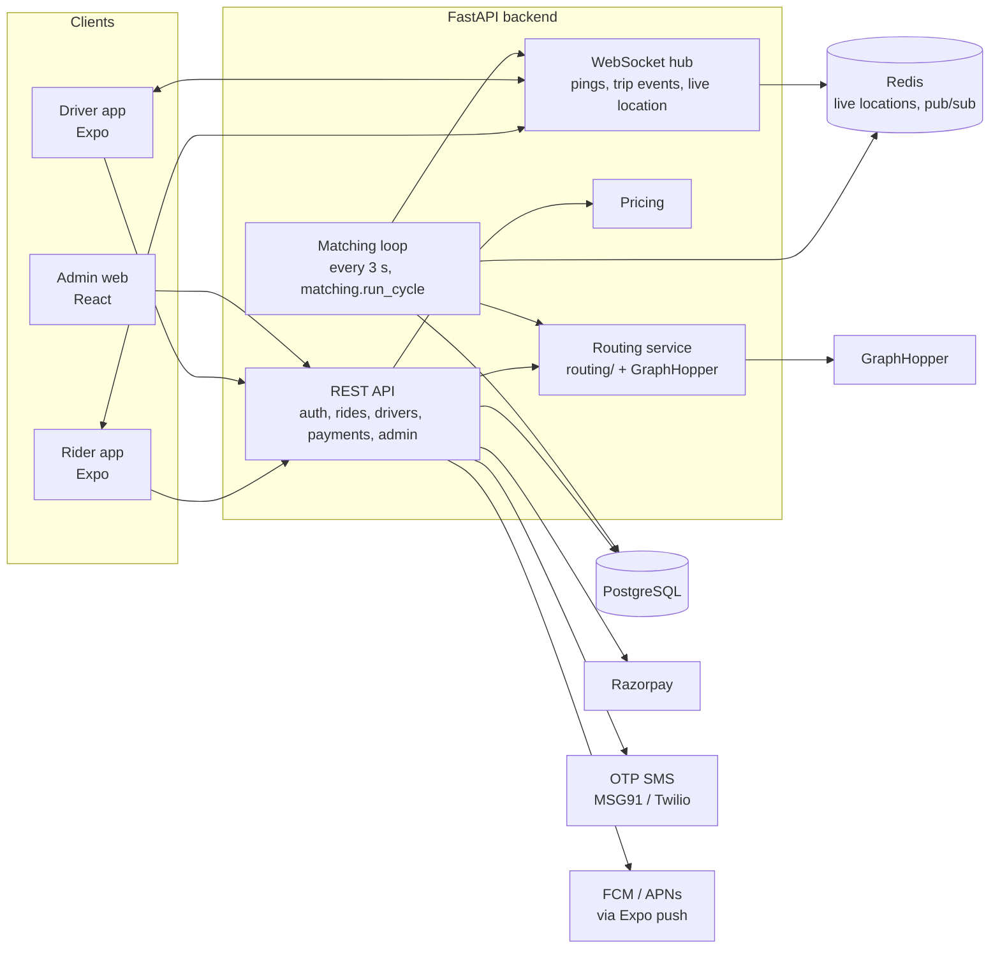

# Plan: from routing engine to a full ride-hailing app (India)

**Decisions:** React Native (Expo) rider and driver apps · Python FastAPI backend · first version = the core ride loop · built in this repo.

## 1. What existed when this plan was written

| Piece | State |
|---|---|
| `routing/` | Route cost model (road hierarchy, telemetry learning, legal limits, access, tolls, zones, turns, point delays, car/auto/bike), OSM importer, GraphHopper adapter. 70+ tests |
| `matching/` | Ride matching (ported from the Node engine, bugs fixed), using routing for pickup ETAs. 21 tests |
| Everything else | Missing: users, auth, trips, pricing, payments, real-time, apps, admin, deployment |

Since then the backend, rider and driver apps, and tests have been built (phases 1–3 below). For the current state see [OVERVIEW.md](OVERVIEW.md); for what's left see the [open issues](../README.md#open-issues).

## 2. Target architecture



- **One backend service (modular monolith)** with separate modules (auth, rides, matching, pricing, payments). It's simpler to build and run than microservices; the module boundaries let us split later if load demands it.
- **The matching loop runs inside the backend.** It builds the `/state` payload from the database, calls `matching.run_cycle`, and turns the changes into database writes and WebSocket events. This is exactly the glue the original engine's README asked the backend to do.
- **Redis** holds live driver locations and spreads WebSocket events across instances. During development an in-memory store does the same job (no Redis on this machine).
- **Maps:** MapLibre in the apps with a hosted OSM tile provider. Use MapTiler or Stadia; the free openstreetmap.org tiles aren't allowed for app traffic. Place search via an India-focused geocoder (Ola Maps or Mappls), behind one interface so it can be swapped.

## 3. Core ride loop (first version)

**Trip states**

```
searching ──(match)──► driver_assigned ──► driver_arrived ──(rider PIN)──► in_progress ──► completed
   │                        │                    │
   └─► no_drivers            └──── cancelled (rider / driver) ──┘   driver cancel → back to searching
```

| Area | First version | Later |
|---|---|---|
| Accounts | Phone OTP login, JWT, roles rider / driver / admin | Social login, email |
| Drivers | Profile + vehicle (car / auto / bike), admin approval, online/offline, live location | Document upload and verification, background checks |
| Booking | Pickup/drop, fare estimate per vehicle type, request, 4-digit ride PIN | Scheduled rides, multiple stops |
| Matching | `matching/` every 3 s; vehicle-type match; road ETAs | Batched / global optimisation |
| Trip | Live driver location to rider, state machine, cancellations | Cancellation fees, waiting charges |
| Pricing | Base + per km + per min + minimum, per vehicle type, in paise | Surge, promo codes, toll amounts |
| Payments | Cash; Razorpay (UPI / card) | Wallet, driver payouts, invoices with GST |
| Ratings | Both directions, 1–5 stars | Feedback categories, driver quality scores |
| Safety | Ride PIN, share-trip link | SOS with ops escalation, call masking |
| Admin | Approve drivers, see live trips, edit fares | Full ops console, support tickets |
| Telemetry | Store driver GPS breadcrumbs | Map matching → `routing.refresh_telemetry` (slow / avoided roads) |

## 4. Repository layout

```
routing/   matching/            existing libraries (unchanged APIs)
backend/app/                    FastAPI: api/, services/, models, schemas
backend/tests/                  API tests: full ride lifecycle, auth, pricing, matching glue
apps/rider/  apps/driver/       Expo apps (TypeScript)
apps/shared/                    API client + types generated from the backend's OpenAPI
admin/                          React + Vite admin
deploy/                         GraphHopper config, docker-compose (Postgres, Redis, API, GraphHopper)
docs/                           design docs + issues
```

## 5. Phases

| Phase | Deliverable | Done when |
|---|---|---|
| **1. Backend core** ✅ done ([BACKEND.md](BACKEND.md)) | Auth (OTP, dev code), users, driver profile, online/location, fare estimate, ride request, matching loop, trip state machine, WebSocket events, cash payments, ratings, minimal admin | An automated test runs a full ride: rider books → driver pinged → accepts → arrives → PIN → completes → both rate |
| **2. Rider app** ✅ core done ([mobile/README.md](../mobile/README.md)) | Login, map, pickup/drop by dragging the pin (search is [issue 012](issues/012-place-search.md)), estimates, book, searching, live tracking, PIN, trip, rating, history | Rider app completes a ride against a simulated driver |
| **3. Driver app** ✅ core done (foreground GPS; push / background GPS pending) | Login, onboarding, go online, background GPS, ping with countdown, accept, navigate (deep link to Google Maps), PIN, complete, earnings | Both apps complete a ride on two phones |
| **4. Payments** (deferred: cash only for now) | Razorpay orders, UPI / card, webhook verification, receipts, driver earnings ledger | Paid ride reconciles with a Razorpay test-mode webhook |
| **5. Admin web** | Driver approval, live map, trips, fare config | Ops can approve a driver and watch a live trip |
| **6. Production** | Postgres + Alembic migrations, Redis, GraphHopper with the city extract, docker-compose, observability, rate limits, security review, load test, store releases | Staging deploy passes a load test of N concurrent rides |

Every phase keeps the test suite green, and each ends with a commit.

## 6. Open decisions (defaults chosen, can change)

| Decision | Default | Why it matters |
|---|---|---|
| Launch city | — | Map extract, speed caps, fares, geocoder coverage |
| OTP provider | MSG91 (India DLT-registered templates) | SMS in India needs DLT registration |
| Map tiles / geocoding | MapTiler tiles + Ola Maps or Mappls search | Cost and India address quality |
| Fares | Placeholder per-vehicle rates in config | Set with real market rates before launch |
| Hosting | Single region in India (e.g. Mumbai) | Latency, data residency |
