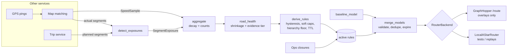

# Routing: road hierarchy + telemetry overlays

> For learning slower roads (traffic vs. road condition) and avoided roads, see [ROAD_LEARNING.md](ROAD_LEARNING.md). Speed limits, private roads, tolls and restricted zones: see [MAP_DATA.md](MAP_DATA.md). Car / bike / auto profiles, turns, and fixed delays at signals and toll booths: see [VEHICLES_AND_TURNS.md](VEHICLES_AND_TURNS.md). Ride matching (driver ↔ rider), which uses this router for pickup ETAs: see [MATCHING.md](MATCHING.md). ETA approximation is tracked in [issue 001](issues/001-eta-approximation.md).

## 1. Overview

Every road segment's cost is

```
Cost = Distance / (Speed × Priority)          [+ distance_influence × km, optional, default 0]
```

- **Speed** is how fast the segment is driven (km/h). Telemetry can only *lower* it.
- **Priority** says how much we want to use the segment: 1.0 = neutral, below 1.0 = penalized, 0 = blocked. Telemetry can only *lower* it.
- Rules multiply together, so a road can be both slower and lower priority. Neither signal erases the other.

**Engine:** [GraphHopper](https://github.com/graphhopper/graphhopper) (Apache-2.0). Its *custom model* uses exactly this formula (`weight ≈ time / priority`), accepts per-request overrides and handles fast queries (LM/A\*). The `routing/` package is the policy layer in front of it. It owns the baseline, turns telemetry into rules, merges them and serializes the result. A local A\* backend runs the same formula for tests and offline replays.

Scope: this package is only the routing function. Trip management, the GPS pipeline and map matching belong to other services. They pass data in through the interfaces in §4.

## 2. Baseline custom model

| road_class | priority |
|---|---|
| MOTORWAY / TRUNK / PRIMARY | 1.0 |
| SECONDARY | 0.9 |
| TERTIARY | 0.8 |
| UNCLASSIFIED | 0.6 |
| RESIDENTIAL | 0.5 |
| LIVING_STREET / SERVICE | 0.2 |
| TRACK | 0.1 |

**Speed: every road is assumed to be driven at the same speed, `UNIFORM_SPEED_KMH` = 30 km/h, capped at its legal limit** ([MAP_DATA.md](MAP_DATA.md)), until telemetry shows a road is slower (see [ROAD_LEARNING.md](ROAD_LEARNING.md)). This keeps the two ideas separate: *preference* comes only from priority, and *slowness* comes only from measured data. Per-class speeds, map speeds and a starting congestion estimate are postponed; see [issue 001](issues/001-eta-approximation.md). `RoutingService` refuses edges whose `speed_kmh` isn't `min(30, legal limit)`, because telemetry measures slowness against that value.

The baseline also always contains the access rules: private, no-entry and delivery-only roads are blocked, and destination-only roads get ×0.1.

Source of truth: [routing/road_classes.py](../routing/road_classes.py). The server copies are [deploy/graphhopper/](../deploy/graphhopper/)`<vehicle>.json`, generated with `routing.graphhopper.write_server_models()`, and a test fails if they drift apart.

With equal speeds, one residential km costs **2×** one primary km (priority 0.5 vs 1.0). So the main road wins unless it is more than twice as long as the residential shortcut.

## 3. Architecture



| Module | Responsibility |
|---|---|
| `road_classes.py` | Hierarchy table, main-road set, hierarchy floor |
| `models.py` | EdgeMeta, telemetry events, Statement / Condition, CustomModel, results |
| `rule_engine.py` | Baseline, validation ("overlays only penalize"), merge, per-edge evaluation |
| `telemetry.py` | Aggregation, road health, evidence tiers, rule derivation with guardrails |
| `monitoring.py` | Deviation detection from planned vs. actual; route-quality records |
| `cost.py` | The cost formula |
| `engine.py` | `RoutingService` facade + `LocalAStarRouter` |
| `graphhopper.py` | Custom-model serialization, segment corridors, HTTP backend |

**Runtime flow**
1. A scheduled job (e.g. every 15 min) calls `RoutingService.refresh_telemetry(samples, exposures)` and stores the new rules and road-health scores.
2. Each route request calls `RoutingService.route(start, end)`. It merges the baseline with the active rules and asks the backend for a path.
3. After each trip, `detect_exposures(planned, actual)` and `route_quality(...)` produce the next round of telemetry.

**Deployment with GraphHopper**
- The baseline lives in the server profile ([config.yml](../deploy/graphhopper/config.yml)), and landmarks (LM) are prepared from it.
- Each request sends only the overlays (`include_baseline=False`). GraphHopper appends them to the profile model. Because overlays can only lower weights, the LM heuristic stays admissible. The trade-off is that CH is not used for this profile.
- **Segment IDs:** GraphHopper's internal edge IDs change on every import. We key everything on a stable `segment_id` (`<osm_way_id>:<from_osm_node>:<to_osm_node>`). Stock GraphHopper has no per-edge expression variable, so the default `area` mode draws a thin polygon around each flagged segment. The condition becomes `in_seg_X && road_class == Y`, which stops the polygon from matching a crossing road of another class. `select_overlays_near` caps this at 200 rules around the trip's bounding box. Once rules become long-lived and number in the thousands, add a custom encoded value (e.g. `segment_penalty`) at nightly import and switch to `expression` mode.

## 4. Data models

- Road metadata: `EdgeMeta` → [schemas/examples/road_metadata.json](../schemas/examples/road_metadata.json)
- Telemetry events: `SpeedSample`, `SegmentExposure` → [schemas/examples/telemetry_events.json](../schemas/examples/telemetry_events.json)
- Override rules: `Statement` → [schemas/override_rule.schema.json](../schemas/override_rule.schema.json), with examples in [override_rules.json](../schemas/examples/override_rules.json)
- Final GraphHopper custom model → [schemas/examples/final_custom_model.json](../schemas/examples/final_custom_model.json) (generated by `python -m examples.print_custom_model`)

A `Statement` holds a target (`speed`/`priority`), a condition (`Always` | `RoadClassIs` | `SegmentIs`), an op (`multiply_by`/`limit_to`), a value, a `source`, a `rule_id`, a `reason` and `expires_at`. Conditions are typed objects, not strings. The same rule can therefore be evaluated locally, checked, and serialized to GraphHopper syntax.

## 5. Sample implementation

```python
from routing import RoutingService, LocalAStarRouter, RoadGraph, GraphHopperRouter

svc = RoutingService(GraphHopperRouter("http://gh:8989", edges), edges)    # or LocalAStarRouter(graph)
svc.refresh_telemetry(speed_samples, exposures)                            # scheduled
route = svc.route((12.9716, 77.5946), (12.9352, 77.6245))                  # per request
```

Key functions:

| Task | Function |
|---|---|
| road_class → priority | `road_classes.priority_for` |
| baseline model | `rule_engine.baseline_model` |
| apply speed limits / avoidance penalties | `CompiledModel.evaluate` (local) or GraphHopper (prod) |
| derive speed + avoidance rules from telemetry | `telemetry.derive_rules` |
| edge / route cost | `cost.edge_cost`, `cost.route_cost` |
| merge base + overrides | `rule_engine.merge_models` |

### Routing engine pseudocode

```
function ROUTE(start, destination, graph, telemetry_rules, ops_rules, now):
    model   ← MERGE(BASELINE, telemetry_rules ∪ ops_rules, now)   # drop expired, validate, dedupe
    src,dst ← SNAP(start), SNAP(destination)
    vmax    ← max expected speed in graph                          # overlays never exceed it
    h(n)    ← haversine(n, dst) / vmax                             # admissible because priority ≤ 1

    open ← {src: h(src)};  g[src] ← 0
    while open not empty:
        u ← pop lowest g[u] + h(u)
        if u = dst: return PATH(parent, dst), g[dst]
        for edge e = (u → v):
            speed    ← e.expected_speed                   # uniform for now
            for s in model.speed where s.matches(e):    speed ← s.limit_to ? min(speed, s.v) : speed × s.v
            priority ← 1
            for s in model.priority where s.matches(e): priority ← s.limit_to ? min(priority, s.v) : priority × s.v
            if speed = 0 or priority = 0: continue      # blocked
            c ← e.distance / (speed × priority)
            if g[u] + c < g[v]: g[v] ← g[u] + c; parent[v] ← e; push v
    return NO_ROUTE
```

`min` and `×` are commutative, so the order of overlay rules never changes the result. A test checks this.

## 6. Future telemetry integration

### Speed-based (potholes, chronic congestion)
Median speed per segment (with time-of-week traffic removed first) → shrunk toward the expected speed: `(w·median + 20·expected)/(w + 20)` → if ratio < 0.70 emit `limit_to`.
With **soft** evidence the speed is capped at no less than half the expected speed. **Hard** evidence (≥150 weighted samples, ≥20 drivers, ≥3 days) is applied as measured, with a 5 km/h minimum.

### Deviation-based (drivers avoid an edge/turn)
`detect_exposures(planned, actual)` records each planned segment the driver reached, and whether they took it. It stops at the first deviation, because the app reroutes after that.
The avoidance rate uses a Beta(1, 19) prior (~5% background): `(dev + 1)/(exposed + 20)`.
- Soft: `priority × max(1 − rate, 0.7)`
- Hard (≥50 weighted exposures, ≥10 *distinct deviating* drivers, ≥3 days) and rate ≥ 0.8: `priority × 0.01`. The segment is still usable if no other route exists.

### Guardrails (why a single bad edge can't reshape the network)
| Guardrail | Effect |
|---|---|
| Time decay (14-day half-life, 60-day window) | Roads recover automatically after repairs |
| Distinct-driver and distinct-day thresholds | One driver, or one bad afternoon, is not consensus |
| Bayesian shrinkage | Sparse data barely moves the estimate |
| Hysteresis (on 0.70 / off 0.80; on 0.30 / off 0.20) | Rules don't flap on and off |
| Soft caps (speed ≥ 50%, priority ≥ 0.7) | Soft signals stay bounded |
| Hierarchy floor | Soft signals cannot make a main road's `speed × priority` fall below 1.1 × residential baseline |
| Validation | Overlays can't boost (priority ≤ 1, speed ≤ expected). Only `ops` may set priority 0 |
| TTL (7 days) | A rule dies unless the next run re-emits it |
| Strictest-wins dedupe | A re-emitted rule never compounds itself |

### Extension points
- **Road health scoring:** `road_health()` returns `speed_ratio`, `avoidance_rate`, `health ∈ [0,1]` and evidence tiers for each segment. Store it for dashboards and for maintenance reports to municipalities.
- **Road condition inference:** add a new signal (e.g. accelerometer roughness). Give it its own `Source`, its own evidence function, and output `Statement`s. No existing code changes.
- **Driver avoidance patterns:** extend `SegmentExposure` with turn/intersection IDs, time-of-day buckets or driver cohorts. Rules can carry time-bucket conditions later (a new `Condition` type plus one serializer branch).
- **Route quality monitoring:** `route_quality()` records followed share, first deviation and ETA error per trip. Alert when these metrics regress after a policy change.
- **Time-of-day models:** keep one rule set per time bucket and choose the set at request time.
- **Tuning:** every threshold is in `TelemetryPolicy`. Before changing live values, replay past trips through `LocalAStarRouter` and compare the chosen routes.

## 7. Why this works

- **Arterials stay preferred.** The baseline is always the first layer. Nothing can raise a road above its baseline, and soft signals cannot push a main road below the residential floor.
- **Telemetry doesn't cause sudden route swings.** Decay, shrinkage, evidence tiers and hysteresis mean a rule appears only after a pattern persists. It fades on its own once the pattern stops.
- **New analytics carry little risk.** Each new signal appends typed, validated, expiring statements. The merge is commutative, so adding a new signal can't change how the existing ones combine.
- **Strong signals still count.** Hard evidence can cut priority to 0.01 or speed to the measured value. The network changes when many drivers show the same pattern over several days, not because of one outlier.

## 8. Acceptance criteria

Covered by `python -m unittest discover -s tests -t .` ([test_routing.py](../tests/test_routing.py); speed/avoidance learning is in [test_traffic.py](../tests/test_traffic.py)):

- [x] With no priorities, the faster residential shortcut wins. With the baseline, the main road wins.
- [x] A soft slowdown on a main road emits a speed rule, and the route still uses the main road.
- [x] Soft deviation evidence caps the penalty at 0.7, and the main road stays in use.
- [x] Hard deviation evidence (≥0.8 avoidance, many drivers and days) sets priority 0.01, and the route switches.
- [x] A single driver's samples never create a rule.
- [x] Data older than the window never creates a rule. Hysteresis keeps a rule during partial recovery.
- [x] Telemetry never gives a residential edge priority above 0.5 or speed above the expected speed.
- [x] Overlays with priority > 1, or telemetry priority 0, are rejected. An ops closure (0) blocks the edge.
- [x] Shuffling the overlays gives the same edge evaluation. Duplicates keep the strictest value. Expired rules are dropped.
- [x] The GraphHopper payload matches the documented format in both `expression` and `area` mode.
- [x] The server model files (`car.json`, `bike.json`, `auto_rickshaw.json`) match the code.

Still open before production: an integration test against a real GraphHopper instance with a regional OSM extract; the stable-segment-ID mapping from GraphHopper path details (`osm_way_id` or a custom encoded value); latency tests with 200 area overlays.
